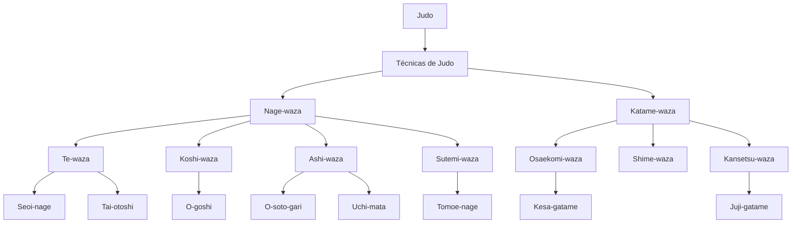

# Judo

Arte marcial y deporte olímpico de origen japonés, creado por [[Kano Jigoro]] a partir del [[Jujutsu]].

Se fundamenta en los principios de máxima eficiencia y prosperidad y beneficio mutuo.

## Taxonomía

## Áreas
- [[Técnicas de Judo]]
- [[Reglamento]]
- [[Entrenamiento]]
- [[Randori]]
- [[Kata]]

## Contexto
- Historia: [[Kano Jigoro]], [[Kodokan]], [[Jujutsu]]
- Práctica: [[Judogi]], [[Dojo y etiqueta]]
- Grados: [[Cinturones]]